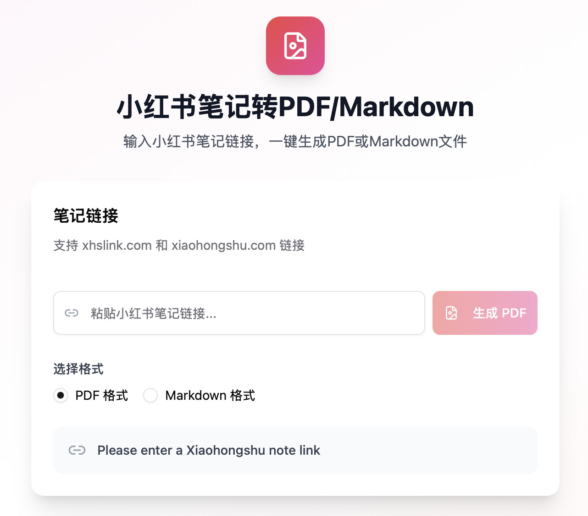

# 小红书笔记转PDF/Markdown工具



一个轻量级的Web工具，可以将小红书笔记/内容一键转换为PDF和Markdown格式，方便归档、分享或二次编辑。

## 功能特点

- 支持 xhslink.com 和 xiaohongshu.com 链接
- 支持导出为 PDF 或 Markdown 格式
- 自动提取笔记中的所有图片
- 按阅读顺序生成文件
- 支持中英文双语界面
- 一键下载

## 项目结构

```
xhs-pdf/
├── app/                    # 前端React应用
│   ├── src/               # 源代码
│   └── dist/              # 构建后的静态文件
├── api/                    # 后端API
│   ├── app.py             # 主应用（整合前后端）
│   ├── main.py            # 纯后端API
│   ├── requirements.txt   # Python依赖
│   └── downloads/         # 生成的文件
├── docs/                   # 文档
└── README.md              # 本文件
```

## 部署方式

### 方式一：整合部署（推荐）

使用整合的 `app.py`，同时提供前端静态文件和后端API服务：

```bash
cd api
pip install -r requirements.txt
playwright install chromium
python app.py
```

访问 http://localhost:8000 即可使用。

### 方式二：前后端分离部署

1. 部署前端静态文件到任意静态服务器：
   - 前端文件位于 `app/dist/`

2. 启动后端API服务：
   ```bash
   cd api
   pip install -r requirements.txt
   playwright install chromium
   python main.py
   ```

3. 修改前端配置：
   - 编辑 `app/.env`
   - 设置 `VITE_API_URL=http://your-backend-url:8000`
   - 重新构建前端

## API接口

### POST /api/convert

转换小红书笔记为PDF或Markdown。

**请求体：**
```json
{
  "url": "http://xhslink.com/xxx",
  "format": "pdf" // 或 "markdown"
}
```

**响应：**
```json
{
  "success": true,
  "message": "转换成功",
  "imageCount": 19,
  "downloadUrl": "/api/download/xxx.pdf",
  "filename": "xxx.pdf"
}
```

### GET /api/download/{filename}

下载生成的文件。

### GET /api/health

健康检查接口。

## 依赖要求

- Python 3.8+
- Node.js 18+（仅开发前端时需要）
- Chromium 浏览器（Playwright会自动安装）

## 技术栈

- 前端：React + TypeScript + Vite + Tailwind CSS + shadcn/ui
- 后端：FastAPI + Playwright + Pillow
- 部署：Uvicorn

## 注意事项

- 工具仅供学习使用，请遵守相关法律法规
- 请尊重原创内容版权
- 生成的文件会在服务器上临时存储，建议及时下载
