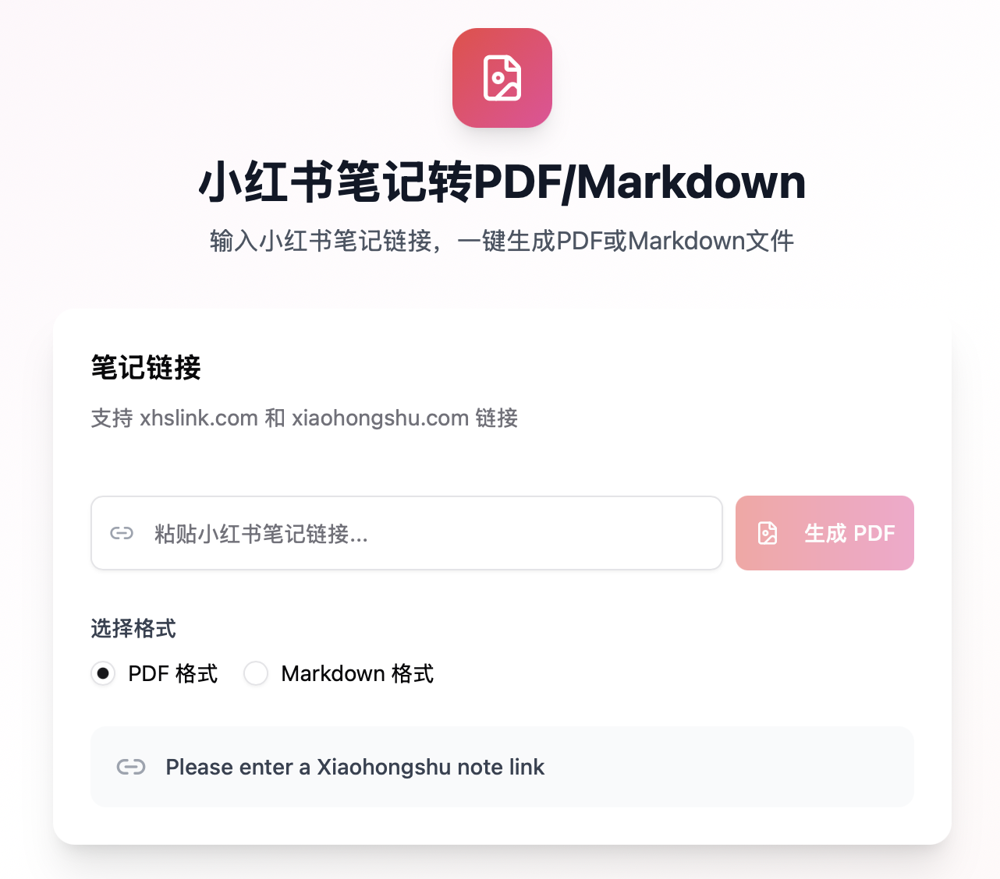

# 小红书笔记转PDF/Markdown工具

<div align="center">



### 轻量级工具，一键将小红书笔记转换为PDF和Markdown格式

[在线演示](https://redbook-convert-production.up.railway.app) • [English](README.md) • [功能特点](#功能特点) • [快速开始](#部署方式) • [API接口](#api接口)

</div>

## 功能特点

- 支持 xhslink.com、xhslink.cn 和 xiaohongshu.com 链接
- 支持直接粘贴纯链接，也支持粘贴整段小红书分享文案，系统会自动提取链接
- 支持导出为 PDF 或 Markdown 格式（PDF 包含正文页与图片）
- 自动提取笔记中的所有图片
- 按阅读顺序生成文件
- 支持中英文双语界面
- 一键下载

## 项目结构

```
xhs-pdf/
├── app/                    # 前端React应用
│   ├── src/               # 源代码
│   └── dist/              # 构建后的静态文件
├── api/                    # 后端API
│   ├── app.py             # 主应用（整合前后端）
│   ├── main.py            # 纯后端API
│   ├── requirements.txt   # Python依赖
│   └── downloads/         # 生成的文件
├── docs/                   # 文档
├── README.md              # 英文文档
└── README-ZH.md          # 本文件
```

## 部署方式

### 方式一：整合部署（推荐）

使用整合的 `app.py`，同时提供前端静态文件和后端API服务：

```bash
cd api
pip install -r requirements.txt
playwright install chromium
python app.py
```

访问 http://localhost:8000 即可使用。

### Railway（Dockerfile 部署）

本仓库已通过 `Dockerfile` + `railway.json` 适配 Railway。

- 线上运行入口是 `api/app.py`（前后端整合），不是 `api/main.py`
- 构建阶段已包含 `playwright install chromium`
- `api/app.py` 与 `api/main.py` 都已包含 Linux 容器稳定启动参数（适配 Railway）

代码推送到 `main` 后，Railway 会自动重新部署。

### 方式二：前后端分离部署

1. 部署前端静态文件到任意静态服务器：
   - 前端文件位于 `app/dist/`

2. 启动后端API服务：
   ```bash
   cd api
   pip install -r requirements.txt
   playwright install chromium
   python main.py
   ```

3. 修改前端配置：
   - 编辑 `app/.env`
   - 设置 `VITE_API_URL=http://your-backend-url:8000`
   - 重新构建前端

## 常见问题（Railway / Playwright）

如果日志出现 `chrome_crashpad_handler: Resource temporarily unavailable (11)`：

- 确认线上已部署到最新代码（包含 `api/app.py` 的 Linux 启动参数）
- 确认服务启动命令为 `uvicorn app:app`（与 `Dockerfile` 一致）
- 更新后可手动触发一次 Redeploy

快速验证：

- `GET /api/health` 返回 `{"status":"ok"}`
- 再调用 `POST /api/convert` 测试有效 `xhslink.com` 链接

## API接口

### POST /api/convert

转换小红书笔记为PDF或Markdown。

**请求体：**
```json
{
  "url": "http://xhslink.cn/xxx",
  "format": "pdf" // 或 "markdown"
}
```

`url` 可以是纯链接，也可以是包含小红书链接的整段分享文案。

**响应：**
```json
{
  "success": true,
  "message": "转换成功",
  "imageCount": 19,
  "downloadUrl": "/api/download/xxx.pdf",
  "filename": "xxx.pdf"
}
```

### GET /api/download/{filename}

下载生成的文件。

### GET /api/health

健康检查接口。

### POST /api/track-visit

记录一次匿名访问。

**请求体：**
```json
{
  "visitorId": "anonymous-uuid",
  "path": "/"
}
```

### GET /api/stats

获取访问与转换统计。

直接在浏览器打开会显示 dashboard；加上 `?format=json` 可返回原始 JSON。

**响应：**
```json
{
  "totalVisits": 120,
  "uniqueVisitors": 87,
  "totalConversions": 42,
  "pdfCount": 30,
  "markdownCount": 12,
  "lastVisitAt": "2026-05-08T03:12:00+00:00",
  "lastConversionAt": "2026-05-08T03:18:00+00:00",
  "databasePath": "/data/stats.db",
  "statsProtected": true
}
```

如果配置了 `STATS_API_KEY`，浏览器访问会先看到登录页；脚本请求仍可带上请求头 `X-Stats-Key: your-key`。

## 访问统计与转化统计

项目现在会统计：

- `totalVisits`：网站总访问次数
- `uniqueVisitors`：近似独立访客数（基于浏览器本地匿名访客 ID）
- `pdfCount`：成功生成 PDF 的次数
- `markdownCount`：成功生成 Markdown ZIP 的次数

统计数据存储在 SQLite 中，默认路径为：

```bash
api/data/stats.db
```

你也可以通过环境变量覆盖：

```bash
STATS_DB_PATH=/data/stats.db
```

推荐的 Railway 配置：

- 添加一个持久化 Volume，并挂载到 `/data`
- 设置 `STATS_DB_PATH=/data/stats.db`
- 可选设置 `STATS_API_KEY=你的密钥`，保护 `/api/stats` 接口

## 依赖要求

- Python 3.8+
- Node.js 18+（仅开发前端时需要）
- Chromium 浏览器（Playwright会自动安装）

## 技术栈

- 前端：React + TypeScript + Vite + Tailwind CSS + shadcn/ui
- 后端：FastAPI + Playwright + Pillow
- 部署：Uvicorn

## 注意事项

- 工具仅供学习使用，请遵守相关法律法规
- 请尊重原创内容版权
- 生成的文件会在服务器上临时存储，建议及时下载
