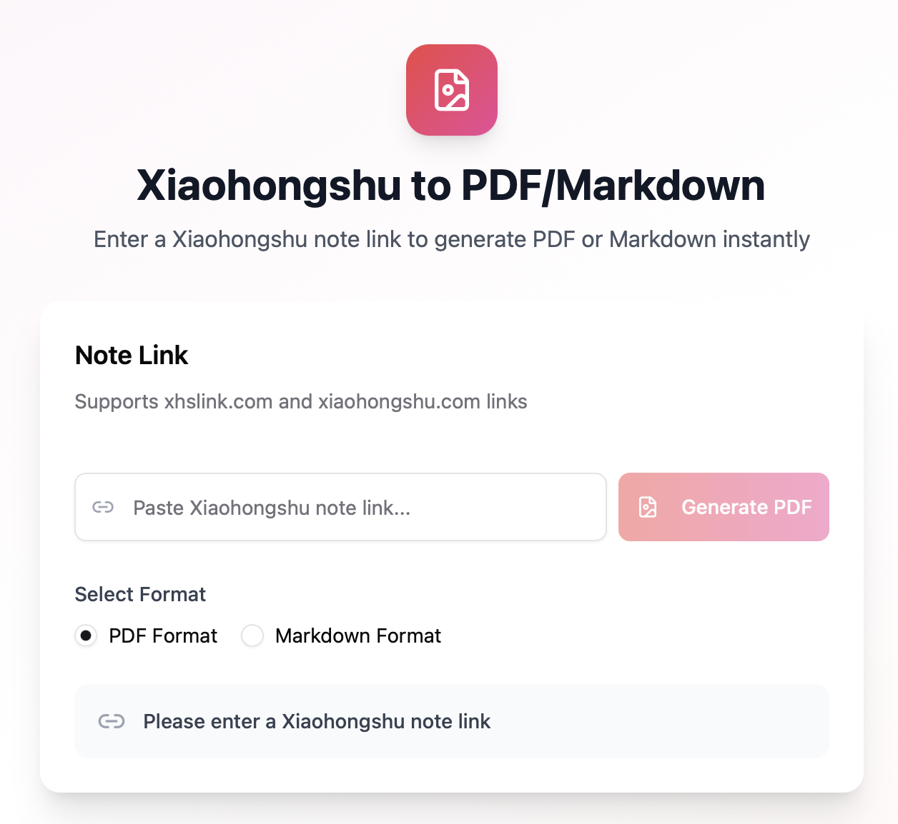

# Xiaohongshu to PDF/Markdown Converter

<div align="center">



### A lightweight web tool that converts Xiaohongshu notes into PDF and Markdown formats

[Demo](#) • [Features](#features) • [Quick Start](#deployment) • [API](#api-endpoints)

</div>

## Features

- Supports xhslink.com and xiaohongshu.com links
- Export to PDF or Markdown format
- Automatically extracts all images from notes
- Generates files in reading order
- Bilingual interface (Chinese/English)
- One-click download

## Project Structure

```
xhs-pdf/
├── app/                    # Frontend React application
│   ├── src/               # Source code
│   └── dist/              # Built static files
├── api/                    # Backend API
│   ├── app.py             # Main app (integrated frontend + backend)
│   ├── main.py            # API-only mode
│   ├── requirements.txt   # Python dependencies
│   └── downloads/         # Generated files
├── docs/                   # Documentation
├── README.md              # English documentation
└── README-ZH.md          # Chinese documentation
```

## Deployment

### Option 1: Integrated Deployment (Recommended)

Use integrated `app.py` to serve both frontend and backend:

```bash
cd api
pip install -r requirements.txt
playwright install chromium
python app.py
```

Visit http://localhost:8000 to use.

### Option 2: Separate Frontend and Backend

1. Deploy frontend static files to any static hosting:
   - Frontend files are in `app/dist/`

2. Start backend API:
   ```bash
   cd api
   pip install -r requirements.txt
   playwright install chromium
   python main.py
   ```

3. Update frontend configuration:
   - Edit `app/.env`
   - Set `VITE_API_URL=http://your-backend-url:8000`
   - Rebuild the frontend

## API Endpoints

### POST /api/convert

Convert Xiaohongshu note to PDF or Markdown.

**Request Body:**
```json
{
  "url": "http://xhslink.com/xxx",
  "format": "pdf" // or "markdown"
}
```

**Response:**
```json
{
  "success": true,
  "message": "Conversion successful",
  "imageCount": 19,
  "downloadUrl": "/api/download/xxx.pdf",
  "filename": "xxx.pdf"
}
```

### GET /api/download/{filename}

Download generated file.

### GET /api/health

Health check endpoint.

## Requirements

- Python 3.8+
- Node.js 18+ (for frontend development only)
- Chromium browser (automatically installed by Playwright)

## Tech Stack

- Frontend: React + TypeScript + Vite + Tailwind CSS + shadcn/ui
- Backend: FastAPI + Playwright + Pillow
- Deployment: Uvicorn

## Disclaimer

- For learning purposes only, please comply with relevant laws and regulations
- Please respect original content copyright
- Generated files are temporarily stored on the server, recommended to download promptly
